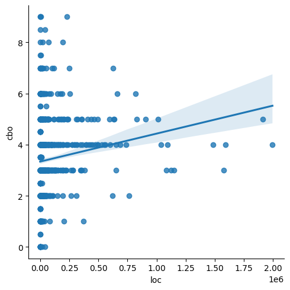

# Relatório 02 - Laboratório de Experimentação de Software

**Guilherme Luiz Carvalho Pinto**

**Pedro Vítor Felix da Costa**

---

_Curso de Engenharia de Software, Unidade Praça da Liberdade_

_Instituto de Informática e Ciências Exatas – Pontifícia Universidade de Minas Gerais (PUC MINAS), Belo Horizonte – MG – Brasil_

---
 

# 1. Introdução

O processo de desenvolvimento de sistemas open-source envolve contribuições de diferentes desenvolvedores, de modo que possa afetar a qualidade do interna do sistema. Para entender a influência do desenvolvimento nas características de qualidade de um software, é preciso analisar aspectos como modularidade, manutenabilidade ou legibilidade. Dessa forma, esse relatório analisa a correlação desses dois fatores considerando repositórios de código aberto do GitHub.

# 2. Hipóteses

**RQ 01. Qual a relação entre a popularidade dos repositórios e as suas características de qualidade?**

Considerando que os repositórios populares atraem a maior parte dos desenvolvedores incluindo desenvolvedores com diferentes níveis técnicos, pode-se concluir que um repositório popular possui fácil entendimento, o que indica em certos aspectos uma boa qualidade de software, pois códigos com grande grau de acoplamento e de espalhamento de mudanças possuem alta complexidade para ser entendida por desenvolvedores de qualquer nível técnico.

**RQ 02. Qual a relação entre a maturidade do repositórios e as suas características de qualidade?**

O fato do repositório ser considerado maduro envolve o tempo de sua existência, o qual considera-se que quanto maior sua idade mais tempo de trabalho envolvido e por consequência maior grau de qualidade de software. De forma que, os repositórios mais velhos possuem mais tempo de desenvolvimento aplicado para melhoria da qualidade do código quando comparado aos repositórios mais novos.

**RQ 03. Qual a relação entre a atividade dos repositórios e as suas características de qualidade?**

Considerando que o repositório que possui maior atividade realiza uma quantidade de entregas contínuas, pode-se concluir que implementam algum tipo de metodologia de ágil para o desenvolvimento do sistema, o qual também exerce influência sobre a qualidade do código, de modo que quanto maior a organização do time, maior é a organização e aspectos de qualidade do software desenvolvido pelo time.

**RQ 04. Qual a relação entre o tamanho dos repositórios e as suas características de qualidade?**

O fato do repositório ser grande envolve a alta quantidade de linhas de código e comentários contidos no mesmo, sendo que é necessário organização para manter uma quantidade alta de código entendível para mais de uma pessoa. Dessa forma, pode-se considerar que os repositórios maiores possuem maior necessidade de implementação de qualidade de código para a manutenção dos mesmos e por consequência devem se preocupar em manter aspectos de qualidade como baixo acoplamento e alta coesão entre a grande quantidade de código existente.

# 3. Metodologia

## 3.1. Criação do script em Python

Inicialmente foi criado um script em python para realizar a coleta de dados e executar a análise dos repositórios. Os passos feitos pelo script serão descritos abaixo:

### 3.1.1. Coleta dos respositórios

O script inicia coletando o nome, quantidade de estrelas, idade e url dos 1000 repositórios com mais estrelas do GitHub que a linguagem principal é Java. As informações foram obtidas utilizando a API GraphQL disponibilizada pela Github e esses dados forma salvos num arquivo CSV.

### 3.1.2. Download do repositório e análise da ferramenta CK

Utilizando as informações salvas no CSV dos repositórios, foi clonado cada um deles e executada a ferramenta CK para que se pudesse recuperar as métricas de software no âmbito de classes: CBO (Coupling Between Objects), DIT (Depth of Inheritance Tree), LCOM (Lack of Cohesion of Methods)e LOC (Lines of Code). Esses dados foram salvos em outro csv, em que foram armazenados as métricas para análise final desse artigo. Para sumarizar essas informações, já que os projetos possuem mais de uma classe, foi cálculada a mediana dos CBOs e LCOMs, o máximo dos DITs e a soma dos LOCs.

### 3.1.3. Remoção do repositório clonado

Após análise de cada repositório, ele deveria ser removido para que o os repositórios não ocupassem todo os espaço disponível em disco e consequentemente impedisse a continuidade da execução do script

### 3.1.4. Geração dos gráficos e do coeficiente de correlação

Por fim, com obtenção das métricas para todos os repositórios coletados, gerou-se os gráficos de dispersão utilizando a biblioteca seaborn e para o cálculo do coeficiente de correção foi utilizada a matplotlib.

# 4. Resultados

A partir das métricas coletadas nos repositórios, foram calculados os seguintes gráficos e coeficientes de correlação:

**Gráfico 1 - CBO x Popularidade (número de estrelas)**

")

Coeficiente de correlação Popularidade x CBO : 
-0.0557

**Gráfico 2 - DIT x Popularidade (número de estrelas)**

")

Coeficiente de correlação Popularidade x DIT : 
0.0784

**Gráfico 3 - LCOM x Popularidade (número de estrelas)**

")

Coeficiente de correlação Popularidade x LCOM : 
-0.0099

**Gráfico 4 - CBO x Idade (anos)**

")

Coeficiente de correlação de Idade (anos) x CBO : 
0.0546

**Gráfico 5 - DIT x Idade (anos)**

")

Coeficiente de correlação de Idade (anos) x DIT : 
0.0349

**Gráfico 6 - LCOM x Idade (anos)**

")

Coeficiente de correlação de Idade (anos) x LCOM : 
0.01661

**Gráfico 7 - CBO x Quantidade de Releases**

Coeficiente de correlação de Quantidade de Releases x CBO : 
0.1642

**Gráfico 8 - DIT x Quantidade de Releases**

Coeficiente de correlação de Quantidade de Releases x DIT : 
0.1325

**Gráfico 9 - LCOM x Quantidade de Releases**

Coeficiente de correlação de Quantidade de Releases x LCOM : 
-0.0198

**Gráfico 10 - CBO x LOC**

Coeficiente de correlação de LOC x CBO : 
0.1430

**Gráfico 11 - DIT x LOC**

Coeficiente de correlação de LOC x DIT : 
0.4301

**Gráfico 12 - LCOM x LOC**

Coeficiente de correlação de LOC x LCOM : 
0.0324

# 4. Discussão

Como foi possível perceber pelos gráficos e coeficientes apresentados na seção anterior, não é possível afirmar que existe uma relação entre as métricas de qualidade utilizadas e os parâmetros popularidade, idade, tamanho do projeto e a atividade dos repositórios.

# 5. Conclusão

Este experimento coletou métricas de qualidade de software dos 1000 repositórios Java com maior popularidade do GitHub. Essa mineração tem o intuito de investigar se existe uma relação entre a qualidade do software e os parâmetros popularidade, idade, tamanho do projeto e atividade do repositório. 

É necessário ressaltar que entre os repositórios coletados existem projetos de direcionados a ensino que não possuem um software em si e sim exemplos de código. Além disso, existem repositórios que não contém código, não possuindo essas métricas.

Após a análise dos dados coletados utilizando os gráficos, foi possível perceber que não existe uma relação das métricas de qualidade coletadas com os parâmetros escolhidos. Logo, as hipóteses apontadas na seção 2 não podem ser confirmadas. A qualidade do código não aumenta ou diminui com a idade, tamanho, atividade ou popularidade do repositório.

Um fator que pode ter colaborado com esse resultado é fato de todos os sistemas populares já serem consolidados em questão de código. Dessa forma, sugere-se para trabalhos futuros que a coleta seja feita com uma quantidade maior de repositórios.

